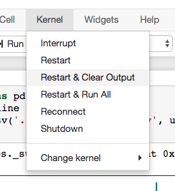

# RNN, LSTM and GRU using TFLearn

ref: [RNNで来月の航空会社の乗客数を予測する：TFLearnでLSTMからGRUまで実装しよう](https://deepage.net/deep_learning/2016/09/17/tflearn_rnn.html)


## Instal Tensorflow with virtualenv

ref: [Installing TensorFlow on macOS](https://www.tensorflow.org/install/install_mac)

```
$ sudo easy_install pip
$ pip install --upgrade virtualenv
```

```
$ virtualenv --system-site-packages <targetDirectory>               # for Python 2.7
$ virtualenv --system-site-packages -p python3 <targetDirectory>    # for Python 3.n
```

```
$ source ./<targetDirectory>/bin/activate       # If using bash, sh, ksh, or zsh
$ source ./<targetDirectory>/bin/activate.csh   # If using csh or tcsh
```

```
(tensorflow)$ easy_install -U pip
```

```
(tensorflow)$ pip install --upgrade tensorflow          # for Python 2.7
(tensorflow)$ pip3 install --upgrade tensorflow==1.3.0  # for Python 3.n
```

The latest version (1.4.0) has a problem with python 3.6, so as a workaround, specifying 1.3.0 version of tensorflow.

## Install other libraries

```
(tensorflow)$ pip3 install pandas
(tensorflow)$ pip3 install matplotlib
(tensorflow)$ pip3 install tflearn
```

You might need to restart a jupyter kernel.



## Use Jupyter

### Jupyter Notebook

#### Install

```
(tensorflow)$ pip3 install jupyter
(tensorflow)$ deactivate && source tflearn_rnn/bin/activate
```

#### Run

```
(tensorflow)$ jupyter notebook
```

### Jupyter Lab

#### Install

```
(tensorflow)$ pip3 install jupyterlab
```

#### Run

```
(tensorflow)$ jupyter lab
```

## Use TensorBoard

#### Install

```
(tensorflow)$ pip3 install tensorboard
(tensorflow)$ deactivate && source tflearn_rnn/bin/activate
```

### Run

```
(tensorflow)$ tensorboard --logdir=/tmp/tflearn_logs
```

Access to [http://localhost:6006/](http://localhost:6006/)

#### Workaround for `AttributeError: module 'site' has no attribute 'getsitepackages'`

Add the following codes to `bin/tensorboard`, line 69.

```
if hasattr(site, 'getsitepackages'):
    # normal execution
    sitepackages = site.getsitepackages()
else:
    # workaround for virtualenv
    from distutils.sysconfig import get_python_lib
    sitepackages = [get_python_lib()]
for mod in sitepackages:
```

ref: [dmlc/tensorboard/issues/38#issuecomment-343017735](https://github.com/dmlc/tensorboard/issues/38#issuecomment-343017735)

##### Error

```
Traceback (most recent call last):
  File "/Users/kenji/work/sandbox-rnn/tflearn_rnn/bin/tensorboard", line 159, in <module>
    Main()
  File "/Users/kenji/work/sandbox-rnn/tflearn_rnn/bin/tensorboard", line 109, in Main
    module_space = FindModuleSpace()
  File "/Users/kenji/work/sandbox-rnn/tflearn_rnn/bin/tensorboard", line 76, in FindModuleSpace
    for mod in site.getsitepackages():
AttributeError: module 'site' has no attribute 'getsitepackages'
```

## Note

* [Installing TensorFlow on macOS](https://www.tensorflow.org/install/install_mac)

(pip install h5py)
